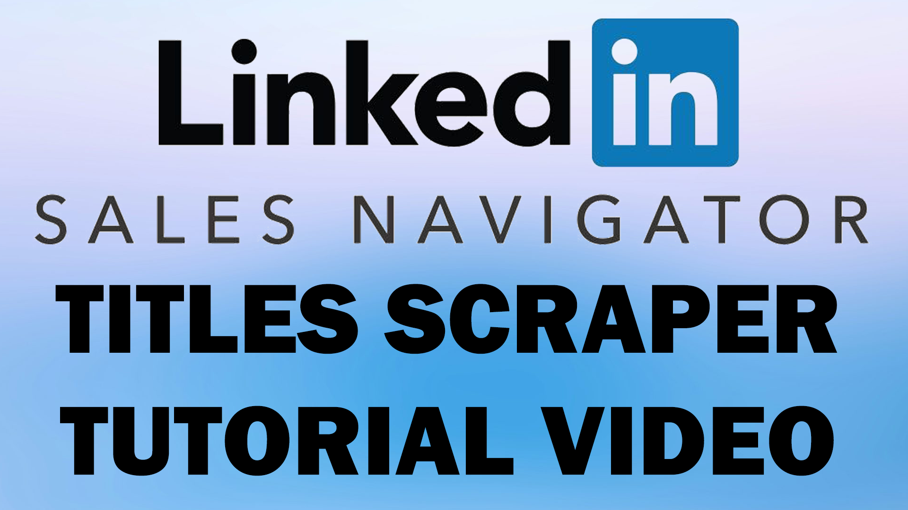

# SalesNav Scraper

> A cross-platform LinkedIn Sales Navigator profile Title scraper.
> Outputs both CSV and XLSX.

## Features

- Headless scraping via Selenium
- Bundles into a single EXE (Windows) or Mach-O binary (macOS)
- Converts results to both **.csv** and **.xlsx**

## Getting Started

1. **Download** either the Windows or MacOS ZIP file based on your operating system
2. Edit the `.env` file by updating it with your Linkedin credentials (you can use any simple text editor)
3. Edit the `links.xlsx` file with your list of Linkedin Sales Navigator profile links
4. Run the executable/app

## 📺 Quick Start Tutorial

Click the image below to watch a 2-minute walkthrough of SalesNavTitles:

